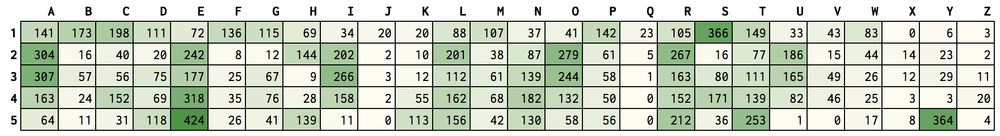
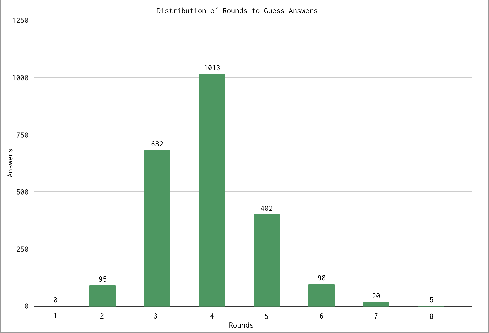

# wordle-bot
A repo for experimenting with powerlanguage's [wordle](https://www.powerlanguage.co.uk/wordle/). All work is done with word lists from release e65ce0a5, which have been modified since NYT's aquisition.

## Operation
The bot plays using hard mode requirements. For each round, the distribution of letters is calculated per position for all remaining answers. Then, each possible guess is scored by using this distribution as a lookup table per position and the word with the highest score is guessed.

Current implementation of hard mode solves 98.9% of solutions within 6 rounds.

