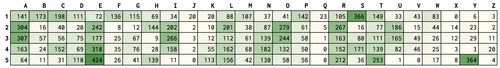
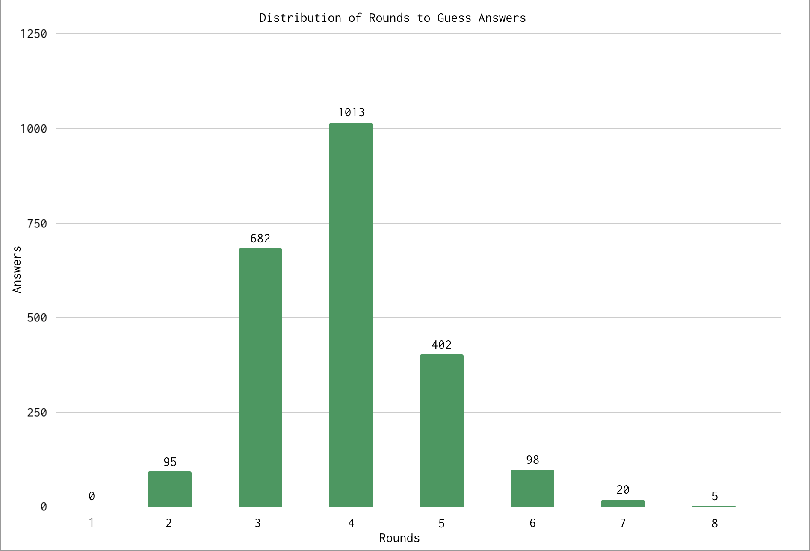

# wordle-bot
A repo for experimenting with powerlanguage's [wordle](https://www.powerlanguage.co.uk/wordle/).

## Operation
For each round, the distribution of letters is calculated per position for all remaining answers. Then, each possible guess is scored by using this distribution as a lookup table per position. The word with the highest score is guessed ("saree" for the default answer list).

Currently implementation of hard mode solves 98.9% of solutions within 6 rounds.

